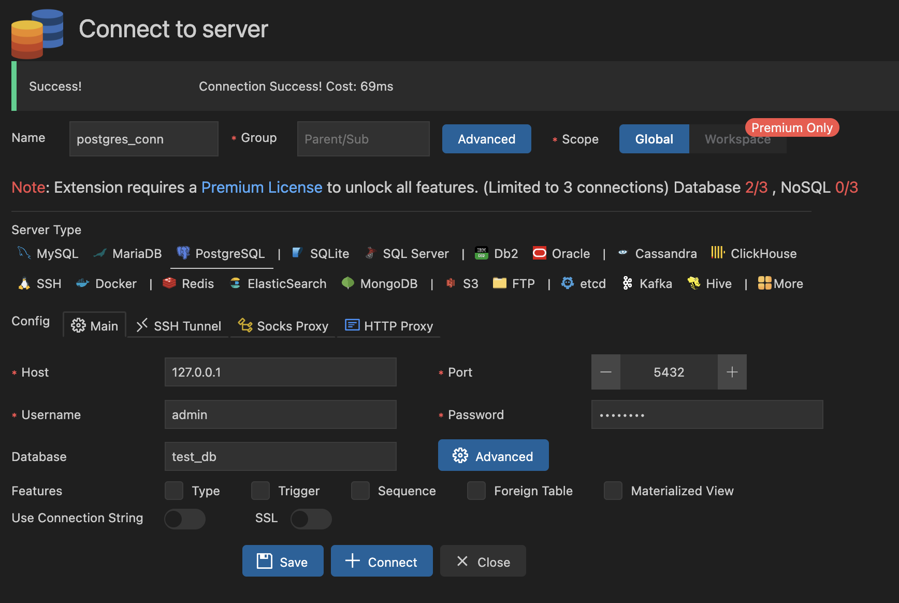
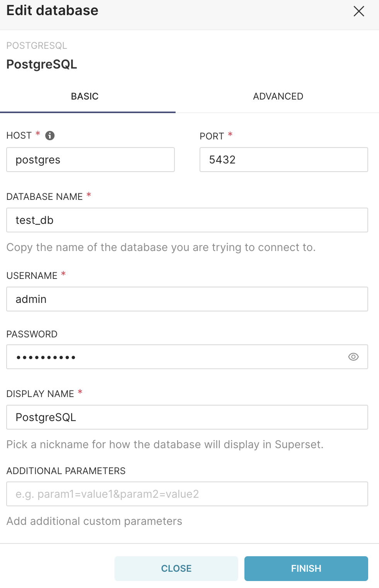

# alrosa_it_techday
Workshop для ивента TechDay

## В данном воркшопе мы:
1. Развернем инфраструктуру
2. Сделаем настройку инфры
3. Запишем данные в raw и core слой
4. Посмотрим их в superset'е и настроим дашборд

## Необходимые программы:
1. Docker, Docker-Compose
2. VScode(опционально)

Работать будем в VScode.
Необходимые расшиирения(плагины):
1. Docker Compose - p1c2u.docker-compose
2. Docker - ms-azuretools.vscode-docker
3. PostgreSQL - cweijan.vscode-postgresql-client2

## Развернем инфраструктуру:

Для этого требуется запустить Docker. 
Далее необходимо сделать docker compose up для файла alrosa_it_techday/services/docker_compose.yaml.

После данной команды поднимутся сервисы нашей практики.

Сделаем настройку инфры:

Для корректной работы нужно настроить подключения к БД Postgres в airlfow.
Настройка подключения Postgres в Airflow:

## Запишем данные в raw и core слой:

Сначала необходимо скачать тестовые данные, которые мы будем записывать:

Нужно разархивировать их и поместить по пути alrosa_it_techday/data/data_samples

Далее нужно запустить DAG.
После отработки pipeline, можно посмотреть данные в БД Postgres через расширение в VSCode.

Настройка подключения Posgtres в VS code:

## Посмотрим их в superset'е и настроим дашборд:

Для начала, нужно настроить подключение к БД, в которую мы записали данные

Настройка подключения Postgres в Superset:

Далее необходимо создать подключение к таблице

После сформируем график(charts) и создадим под него дашборд. 

## Какие ML проекты можно построить на основе этих данных?